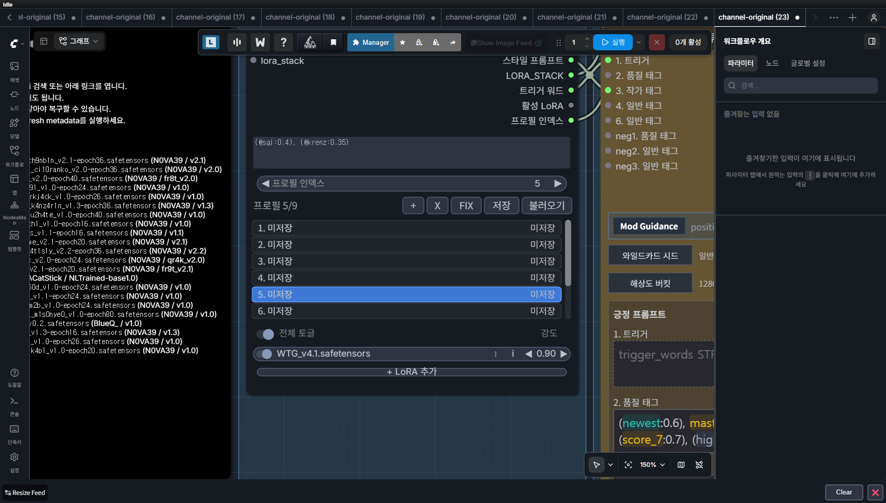
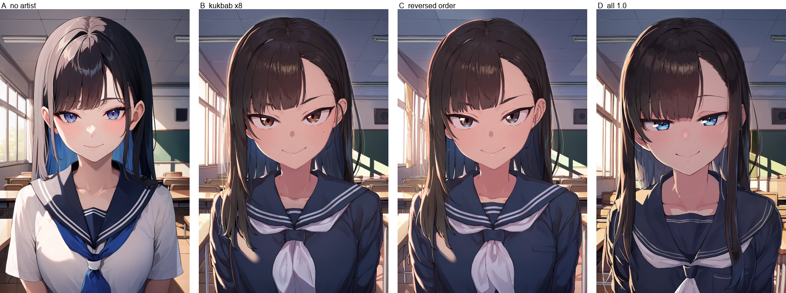
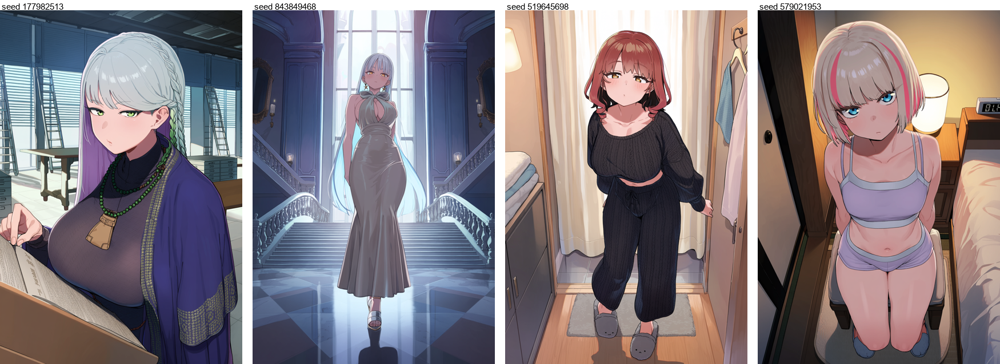

# 내 컴퓨터에서 그림 뽑기 — 처음부터

> **결론부터.** 워크플로우 `AiO_v60_local.json` 하나를 열고, 프롬프트 3번 칸에 원하는 걸 쓰고,
> 노란 그룹을 끈 채로 실행하면 20초 만에 초안이 나온다. 마음에 들면 노란 그룹을 켜고 다시 돌린다.
> **그게 전부다.** 아래는 그 각 단계에서 무엇을 어떻게 정하는지다.

---

## 0. 전체 판도 — 지금 시장에 뭐가 있나

**애니메 그림은 별개 시장이다.** 이걸 먼저 알아야 나머지가 정리된다.

미드저니·DALL-E·GPT-Image 는 사진과 일러스트에서 최상위지만 **애니메 그림체는 잘 못 그린다.**
반대로 애니메를 잘 그리는 모델은 일반 사진을 못 그린다. 그래서 두 시장이 갈려 있다.

### 큰 세 갈래

| 갈래 | 무엇 | 대표 |
|---|---|---|
| **클라우드 범용** | 웹에서 돈 내고 쓴다. 설치 없음 | GPT-Image · Nano-Banana(제미나이) · 미드저니 · DALL-E |
| **클라우드 애니메** | 애니메 전문. 유료 | **NovelAI (NAI)** |
| **로컬 오픈웨이트** | 내 컴퓨터에서 돈다. 무료·무검열 | **ANIMA** · Illustrious/NoobAI · Z-Image · Flux · Chroma |

### 애니메 기준 티어 (채널 2026-05)

| 티어 | 모델 | 종류 |
|---|---|---|
| 1 | GPT-Image 2 · Nano-Banana 2/Pro | 클라우드 범용. **애니메 특화는 아님** |
| 2 | Z-Image · Qwen-Image-Edit | 로컬 범용 |
| 3 | Flux.2 · Chroma1-HD | Chroma 는 "무검열 중 성능 최고, **대신 엄청 느림**" |
| **4** | **ANIMA** · **NAI 4.5/V5** | **애니메 무검열. 여기가 우리 자리** |
| 5 | NoobAI · Illustrious 계열 SDXL | "가볍고 빠르지만 **구식**" |

**ANIMA 와 NAI 가 같은 티어다.** 즉 **로컬 최상위와 유료 서비스가 대등하다.**

### NAI vs 로컬 — 실제로 뭐가 다른가

| | NAI (유료 클라우드) | ANIMA (로컬) |
|---|---|---|
| 돈 | 월 구독 | **무료** |
| 설치 | 없음 | ComfyUI 필요 |
| 검열 | 없음 | **없음** |
| 최신 캐릭터 | **안다** | 2025-09 까지만. **로라로 메움** |
| 프롬프트 해석 | 구도를 알아서 잡아줌 | **명시해야 함** |
| 세밀 제어 | 제한적 | **인페인팅·영역분리·업스케일 전부 가능** |
| 속도 | 1~2초 | 20초(초안) / 2분(마감) |
| 대량 생산 | 할당량 제한 | **무제한** |

**NAI V5 가 2026-08-21 에 나와서 채널이 뒤집혔다.** 로컬이 그걸 따라가는 데는 시간이 걸린다.
다만 **프롬프트는 가져올 수 있고**, 그게 8절에서 다루는 내용이다.

!!! note "미드저니는 왜 안 쓰나"
    애니메 그림체가 약하고, **로라·인페인팅·영역분리 같은 제어가 없다.**
    그리고 성인 소재를 못 만든다. 목적이 다른 도구다.

---

## 1. 채널 표준 세팅 — 무엇을 갖춰야 하나

여기서부터는 **채널이 배포하는 구성을 그대로 따른다.** 우리 컴퓨터에 뭐가 있는지가 아니라,
**무엇이 있어야 하는지**가 기준이다. 마지막에 우리 상태와 대조한다.

### ① 워크플로우 — 5개로 나눈다

채널 포터블 팩이 넣어 주는 구성이다. **나누는 기준은 모델 계열과 큰 용도 두 가지뿐이다.**

| 파일 | 모델 계열 | 용도 |
|---|---|---|
| ANIMA 심플 t2i | ANIMA | 가볍게 |
| **ANIMA t2i 올인원** | ANIMA | **주력** |
| SDXL·IL 올인원 t2i | SDXL | WAI 계열 |
| ANIMA SAM3 인페인팅 | ANIMA | 부분 수정 |
| SDXL·IL SAM3 인페인팅 | SDXL | 〃 |

!!! danger "워크플로우와 모델은 짝이 정해져 있다"
    ANIMA 는 **Cosmos 기반 DiT + Qwen3 텍스트 인코더**, WAI 는 **SDXL + CLIP** 이다.
    구조가 아예 다르므로 **모델도 로라도 컨트롤넷도 섞이지 않는다.**
    배포자들이 워크플로우를 계열별로 아예 갈라 배포하는 이유다.

### ② 모델 — 파일 세 개를 각각 다른 폴더에

ANIMA 는 체크포인트 한 덩어리가 아니라 **세 조각으로 나뉘어 있다.**

```
Base v1.0        →  models/diffusion_models
텍스트 인코더     →  models/text_encoders   (qwen_3_06b_base.safetensors 로 개명)
VAE              →  models/vae
```

한 폴더에 다 넣으면 안 된다. **"체크포인트 파일이라길래 checkpoints 폴더에 넣었는데 작동을 안 한다"**
가 반복되는 사고다.

INT8 판은 세 개 합쳐 4GB 미만이라 VRAM 8GB 급에서도 돌아간다.

### ③ 필수 커스텀 노드

채널이 2026년에 반복 추천하는 것들이다.

| 노드 | 왜 |
|---|---|
| **ComfyUI-Manager** | 나머지를 설치하는 관문 |
| **EasyUseAnima** | AiO 워크플로우의 뼈대. 프롬프트 스튜디오·로라 프리셋·와일드카드 |
| **Impact-Pack / Subpack** | 와일드카드 · 디테일러 · SEGS |
| **SAM3 / easy-sam3** | 자연어로 마스크를 만든다. ANIMA·SDXL 양쪽 |
| **rgthree-comfy** | **Fast Group Bypasser** — 단계 온오프. 이게 없으면 초안/마감 전환이 지옥이다 |
| **KJNodes** | Set/Get 변수. 선을 줄인다 |
| **UltimateSDUpscale** | 타일 업스케일 표준 |
| **Anima-LLLite** | ANIMA 의 **유일한** 컨트롤넷 수단 |
| **Spectrum-KSampler** | ANIMA 가속 |
| **ComfyUI-DCW** | 디테일 보정 |

### ④ 제어 모델 (LLLite)

ANIMA 는 SDXL 컨트롤넷이 **구조적으로 안 붙는다.** LLLite 만 된다.

| 파일 | 크기 | 무엇 |
|---|---|---|
| `anima-lllite-any-test-like-v2` | 16MB | **구도 제어. 이게 없으면 반쪽이다** |
| `anima-lllite-inpainting-v2` | **65.8MB** | 인페인팅 |
| `anima-lllite-depth-1` / `lineart-1` / `scribble-1` | 각 8MB | 보조 |

!!! warning "크기로 진품을 확인하라"
    커뮤니티판을 **파일명만 바꿔** 배포하는 경우가 있다.
    `inpainting-v2` 는 정품이 **65.8MB** 다. 23MB 짜리는 가짜다.

### ⑤ 와일드카드

노드는 다 있어도 **넣을 파일이 없으면 껍데기**다. 경로는 세대가 바뀌었으니 주의.

```
옛날(WebUI)  sd-dynamic-prompts/wildcards      ← 이제 안 쓴다
지금(ComfyUI) custom_nodes/impact-pack/wildcards
EasyUseAnima  user/__easyuse_anima/wildcards
```

### ⑥ 태그 사전

프롬프트를 쓰려면 태그를 알아야 하고, 자동완성이 있어야 손이 빨라진다.

| | 규모 | 갱신 |
|---|---|---|
| `DraconicDragon/dbr-e621-lists-archive` | **201,269개** (작가 88,149) | 매월 1일 |
| `ComfyUI-Autocomplete-Plus` | — | **한국어 별칭 검색 지원** |

---

## 1-1. 우리 상태 대조

| 항목 | 채널 표준 | 우리 | |
|---|---|---|---|
| 워크플로우 | 5개 | **3개** | ⚠ 인페인팅 전용 2개 없음 (AiO 안에 그룹으로는 있음) |
| ANIMA 모델 | 3조각 분리 배치 | ⭕ | `anima-aesthetic-v1.1` |
| WAI Illustrious | 1벌 | ⭕ | v1.7 |
| 필수 노드 10종 | | ⭕ | 전부 설치됨 |
| **LLLite 제어** | 6종 | ⭕ | **정품으로 교체 완료** |
| **와일드카드** | 파일 필요 | ❌ | **비어 있다 — 노드가 껍데기 상태** |
| 태그 사전 | 201k · 매월 갱신 | ⚠ | 우리 것은 114k 고정판 |
| 로라 | — | ⭕ | **40개** |
| 로컬 LLM | — | ⭕ | 무검열 2종 |

**빠진 것은 둘이다** — 와일드카드 파일, 그리고 최신 태그 사전.

---

## 1. 화면 열기

브라우저에서 `http://127.0.0.1:8188` 을 연다. 안 떠 있으면 `F:\AI\ComfyUI` 의 실행 배치를 누른다.



화면이 이렇게 생겼다. 지금 보이는 것들이 각각 무엇인지부터.

| 화면 위치 | 무엇 |
|---|---|
| 왼쪽 세로 아이콘 | 에셋 · 노드 · 모델 · **워크플로우** · 템플릿 |
| 가운데 | **캔버스.** 노드가 놓인 작업판 |
| 위쪽 파란 **실행** 버튼 | 생성 시작 |
| 오른쪽 **워크플로우 개요** | 파라미터 목록 |

**워크플로우를 여는 법** — 왼쪽 세로 아이콘 중 「워크플로우」를 누르면 파일 목록이 나온다.
`00_ACTIVE` 안의 `AiO_v60_local.json` 을 연다.

!!! tip "노드가 화면 밖에 있어서 안 보일 때"
    캔버스를 클릭하고 **마침표 키(`.`)** 를 누르면 전체가 화면에 맞춰진다.

---

## 2. 프롬프트 — 어디에 무엇을 쓰나

칸이 여러 개로 나뉘어 있다. 위 캡처의 오른쪽에 보이는 목록이 그것이다.

```
1. 트리거      로라를 부르는 암호. 로라를 안 쓰면 비워 둔다
2. 품질 태그    이미 채워져 있다. 건드리지 않는다
3. 작가 태그    그림체를 정한다
4. 일반 태그    ★ 무엇을 그릴지. 매일 만지는 곳은 여기다
6. 일반 태그    이어지는 칸
neg1~3        네거티브. 이미 채워져 있다
```

**칸이 나뉘어 있을 뿐, 최종적으로는 다 합쳐서 하나로 들어간다.**
위에서 아래 순서로 이어 붙는다. 꺼진 칸은 안 들어간다.

### 무엇부터 쓰나 — ANIMA 공식 순서

```
품질 → 메타 → 연도 → 안전등급 → 인원수 → 캐릭터 → 작품명 → 작가 → 일반태그
```

칸이 이미 이 순서로 배치돼 있으므로, **각 칸에 해당하는 것만 넣으면 순서는 저절로 맞는다.**

### 4번 칸에 쓰는 법

영어 단어를 쉼표로 나열한다. 이것이 **태그**다.

```
1girl, solo, upper body, looking at viewer,
long hair, school uniform, classroom, window, sunlight,
smile, closed mouth
```

| 종류 | 예시 |
|---|---|
| 인원 | `1girl` `2girls` `solo` |
| 구도 | `upper body` `cowboy shot` `full body` `portrait` `close-up` |
| 시점 | `from below` `from above` `from side` |
| 외형 | `long hair` `blue eyes` `school uniform` |
| 배경 | `classroom` `outdoors` `night` `simple background` |
| 표정 | `smile` `open mouth` `jitome`(가는 눈) |

!!! warning "프롬프트는 늘리는 게 아니라 줄이는 것이다"
    채널의 축적된 결론이다.

    > AI 는 입력된 프롬프트를 **전부 수행해내려 한다.** 그러니 자원이 필요한 곳에만 몰빵되게
    > **최대한 간결하고 정확한 명령**을 해야 한다.

    네거티브 380개를 실측한 글의 결론도 같다 —
    **"고봉밥 네거는 좋은 건 없고 안 좋은 것만 모아놓은 애물단지"**

### 태그를 모르겠을 때 — 찾는 곳

| 방법 | 어디 |
|---|---|
| **한국어로 검색** | 우리 태그 사전 11만 개. 스튜디오(`127.0.0.1:7860`)의 태그 검색 |
| 사이트에서 찾기 | `taghelper.baepoyong.com` — 단부루 프롬프트 도우미 |
| 남의 그림에서 뽑기 | `aitag.win` — 픽시브 그림의 프롬프트 수집 |
| 아카 링크에서 뽑기 | `python fromlink.py <링크>` — 그 그림의 프롬프트를 그대로 가져온다 |

---

## 3. 그림체 — 작가 태그

3번 칸에 작가 이름을 넣으면 그 작가의 화풍이 섞인다.

```
(@wagashi \(dagashiya\):0.9), (@zankuro:0.85), (@ningen mame:0.9)
```

ANIMA 는 `@이름` 문법을 쓴다. 괄호가 이름에 들어 있으면 `\(` `\)` 로 이스케이프한다.

### 세 가지 규칙

**1. 혼자 쓰지 않는다.** 채널 집계로 **5~16명**을 섞는다. 중앙값 8명.

**2. 가중치는 눌러 쓴다.** `0.7~0.89` 구간에 37% 가 몰린다. **1.0 을 넘기면 오히려 나빠진다.**



같은 시드로 축 하나씩만 바꾼 것이다.

| | 결과 |
|---|---|
| A 작가 없음 | 밝고 평면적 |
| B 국밥 8명 | **눈매가 또렷해지고 음영이 깊어진다** |
| C 순서만 뒤집음 | B 와 거의 같다 — **ANIMA 에서는 순서가 안 먹는다** |
| D 전부 1.0 | **가장 나쁘다.** 어둡고 눈이 처진다 |

**3. 어떤 작가를 넣을지 모르겠으면 「국밥」부터.** 아무 데나 넣어도 안정적인 작가들이다.

```
(@wagashi \(dagashiya\):0.9), (@null \(nyanpyoun\):0.8), (@zankuro:0.85),
(@ningen mame:0.9), (@naga U:0.85), (@morino hon:0.85)
```

### 작가를 그림 보고 고르는 곳

| 곳 | 규모 |
|---|---|
| **`animastyles.thetacursed.com`** | **작가 42,509명.** 프리뷰가 ANIMA 로 직접 생성한 것이라 우리 모델 기준이다 |
| ComfyUI 노드 `Anima Artist Browser` | 20,000명. 캔버스에서 바로 고른다 |

각 작가가 무엇을 바꾸는지는 [작가 태그 사전](artist-tags.md) 에 94명 정리돼 있다.

---

## 4. 로라 — 특정 캐릭터·화풍 불러오기

작가 태그로도 안 되는 것이 있다. **모델이 모르는 캐릭터**다.
ANIMA 는 2025년 9월까지만 학습해서 그 뒤에 나온 캐릭터를 모른다. 그때 쓰는 것이 로라다.

### 지금 있는 로라 40개

두 폴더에 나뉘어 있다. **ComfyUI 는 둘 다 읽는다.**

```
F:\AI\ComfyUI\ComfyUI\models\loras\    11개
F:\AI\models\loras\                    29개
```

| 폴더 | 개수 | 무엇 |
|---|---|---|
| `ANIMA_STYLE_LORA/` | 20 | **화풍 로라.** 번호로만 되어 있다 |
| `CIVITAI_CHARACTER/` | 5 | 캐릭터 |
| `WEBTOON/` | 2 | 웹툰체 (`WTG_v4.1`) |
| `WUWA/` | 3 | 명조 캐릭터 |
| 루트·기타 | 10 | 루루카 · 큐어 아르카나 · 터보 등 |

### 트리거 워드 — 로라를 부르는 암호

로라를 켜는 것만으로는 안 되고, **정해진 단어를 프롬프트에 넣어야** 작동하는 경우가 많다.

| 로라 | 트리거 | 베이스 |
|---|---|---|
| `anima_moria_luluka_v1.1` | `moria luluka, meitantei precure!` | ANIMA |
| `anima_cure_arcana_shadow` | `curearcanashadow` | ANIMA |
| `WEBTOON/WTG_v4.1` | **`wtg, @sgj`** | ANIMA |
| `WUWA/suisui_anima_v1` | **`suisuiwuwa`** | ANIMA |
| `CIVITAI_CHARACTER/iuno_ilxl` | `iuno` | **SDXL** |
| `CIVITAI_CHARACTER/Cho_Kaguya-hime` | `cho_v1`, `c_yachiyo` | **SDXL** |

전체 목록은 이 명령으로 언제든 다시 볼 수 있다.

```bash
cd F:\AI\studio
python catalog.py loras
```

!!! danger "베이스가 다르면 못 쓴다"
    표의 「베이스」 칸이 **SDXL** 인 로라는 **ANIMA 워크플로우에 넣으면 안 된다.**
    `ishtar_ilxl` · `iuno_ilxl` · `Cho_Kaguya-hime` 이 그렇다 — WAI 워크플로우에서만 쓴다.

### 로라를 지정하는 곳

위 캡처의 왼쪽 가운데에 보이는 **「LoRA 프리셋」** 노드다.

```
프로필 5/9        ← 프로필 9개를 저장해 두고 번호로 갈아탄다
+ / X / FIX      ← 추가 / 삭제 / 경로 복구
저장 / 불러오기
─────────────────
WTG_v4.1.safetensors    0.90    ← 로라 이름과 강도
+ LoRA 추가
```

**강도**는 0.0~1.0 이다. 우리 실측으로는:

| 상황 | 권장 |
|---|---|
| 인물이 화면을 크게 차지 (얼굴 클로즈업) | **0.65** |
| 배경이 넓은 그림 | 0.45 |
| 화풍만 살짝 | 0.3 |

**클로즈업에서 0.45 로 낮추면 캐릭터가 통째로 무너진다.** 실제로 겪은 일이다.

### 로라 프리뷰를 그림으로 보기

`http://127.0.0.1:8188/loras` 를 열면 로라 매니저가 뜬다.
Civitai 에서 프리뷰 이미지와 트리거 워드를 자동으로 가져온다. API 키는 이미 넣어 뒀다.

---

## 4-1. 와일드카드 — 프롬프트를 안 짜고 뽑기

**프롬프트를 매번 쓰는 게 힘들면 이걸 쓴다.** 미리 만들어 둔 목록에서 무작위로 뽑아 준다.

### 부르는 법

```
__폴더/파일명__
```

밑줄 두 개로 감싸면 그 파일의 **줄 하나가 무작위로** 뽑혀 들어간다.

### 채널 배포본 199개

```
Clothes/      34개   일상복 · 판타지 · SF · 특수 의상
Character/     2개   동물 · 몬스터 의인화
Pose/ Place/         의상마다 어울리는 포즈·장소가 짝지어져 있다
Eyes / HairStyle / HairColor / SkinTone / Makeup / Eyebrow / Eyelash
Call_Clothes_Pose_Place.txt    ← 호출 문서
```

### 핵심은 호출 문서다

`Call_Clothes_Pose_Place` 안은 이렇게 생겼다.

```
__Clothes/Animal_120_v6__, __Place/Place_AnimalClothing_100_v1__, __Pose/Pose_AnimalClothing_104_v1__
__Clothes/Armor_CombatSuit_180_v3__, __Place/Place_Armor_CombatSuit_100_v1__, __Pose/Pose_Armor_CombatSuit_104_v1__
```

**의상·장소·포즈가 한 줄로 묶여 있다.** 갑옷을 뽑으면 갑옷에 어울리는 장소와 포즈가 같이 나온다.
따로따로 뽑으면 갑옷 입고 침대에 눕는 식이 되는데, 그걸 막아 준다.

### 실제로 쓰는 법

4번 칸에 이렇게만 쓴다.

```
1girl, solo, upper body, looking at viewer,
__HairStyle_Feminine_440_v12__, __HairColor_Feminine_120_v2__, __Eyes_150_v6__,
__Call_Clothes_Pose_Place__
```

실행할 때마다 머리·눈·의상·포즈·장소가 전부 바뀐다. **초안 가챠에 최적이다.**



위 한 줄로 뽑은 것이다. 넷 다 인물·의상·장소가 다른데 **각각 맥락이 맞는다.**

| | 나온 것 |
|---|---|
| 1 | 종교 복장 · 염주 → **문서고에서 고문서를 넘긴다** |
| 2 | 이브닝 드레스 → **대리석 계단 대저택** |
| 3 | 니트 상하의 · 슬리퍼 → **탈의실 앞** |
| 4 | 속옷 → **침실** |

의상이 정해지면 **거기 어울리는 장소와 포즈가 따라온다.** 이게 호출 문서의 값어치다.

### 전개된 실제 프롬프트

`__Call_Clothes_Pose_Place__` 한 줄이 이만큼으로 펼쳐진다.

```
calf-length hair, single four-strand braid, smooth upper shape,
silver hair with a lavender underside, seaweed-green eyes,
female Hindu ascetic attire, deep saffron wrapped robe, fitted blouse,
broad shoulder shawl, simple sandals, prayer beads, scripture pouch,
cathedral archive with bound registers, locked document drawers, rolling ladders
```

!!! note "배포자가 밝힌 전제"
    > 본 와일드카드는 **Anima 의 자연어 처리능력에 크게 의존**하고 있습니다.
    > 이외의 모델에서는 돌려본 적이 없어 사용 시 참고 부탁드립니다.

    즉 **ANIMA 전용**이다. WAI 워크플로우에서는 결과가 다를 수 있다.

### 파일을 넣는 곳

세대가 바뀌었으니 옛 글을 그대로 따르면 실패한다.

```
custom_nodes/ComfyUI-Impact-Pack/wildcards/     ← 지금은 여기
user/__easyuse_anima/wildcards/                 ← EasyUseAnima 를 쓸 때
sd-dynamic-prompts/wildcards/                   ← 옛날 WebUI. 이제 안 쓴다
```

---

## 5. 크기 정하기

ANIMA 권장 해상도는 다음과 같다. 아무 숫자나 넣으면 안 된다.

| 용도 | 크기 |
|---|---|
| 세로 (인물) | **832×1216** · 1024×1536 |
| 가로 | 1216×832 · 1536×1024 |
| 정사각 | 1024×1024 |

**세로/가로 비가 구도를 지배한다.** 얼굴 클로즈업을 세로로 뽑으면 정수리와 턱이 잘린다.
프롬프트로 고치려 하지 말고 캔버스 비부터 맞춘다.

---

## 6. 초안 → 고르기 → 마감

**한 번에 완성본을 뽑지 않는다.** 이것이 채널 표준이다.

### 모드 전환 노드

캔버스 가운데 위쪽에 노란 노드가 있다.

```
★ 모드 전환 — 노랑=마감 / 보라=수정 / 초록=릴레이
```

체크박스로 그룹을 켜고 끈다.

| 체크 | 그룹 | 색 |
|---|---|---|
| ☐ | 4. HighRes | 노랑 |
| ☐ | 6.1 얼굴 디테일러 | 노랑 |
| ☐ | 6.2 눈 디테일러 | 노랑 |
| ☐ | 7. Upscale | 노랑 |
| ☐ | 5. Inpainting | 보라 |
| ☐ | I2I | 초록 |

### 순서

**① 초안** — 노랑 4개를 **전부 끄고** 실행. **20초.**
같은 프롬프트로 4~5번 돌린다. 시드가 매번 달라져서 다른 그림이 나온다.

**② 고르기** — 마음에 드는 것 하나를 고른다.

**③ 마감** — 그 그림의 PNG 를 **캔버스에 끌어다 놓으면** 시드와 설정이 그대로 복원된다.
노랑 4개를 **켜고** 다시 실행. **2분.**

!!! note "왜 이렇게 하나"
    > 업스케일까지 하면 2분이 넘는다. 굳이 할 이유가 없다. **디테일러만 돌려도 1분이나 걸린다.**

    20초짜리로 여러 장 뽑아 고르는 편이 훨씬 빠르다.

---

## 7. 로컬 AI 로 프롬프트 짜기 — 검열 없이

프롬프트를 영어로 짜는 게 힘들면 **한국어로 쓰고 AI 에게 태그로 바꾸게** 하면 된다.
로컬에서 도는 무검열 모델이 이미 깔려 있어서 **성인 소재도 거절하지 않는다.**

### 깔려 있는 모델

| 이름 | 컨텍스트 | VRAM | 언제 |
|---|---|---|---|
| `qwen35-heretic:9b` | 32,768 | 6.2GB | **그림 뽑으면서 같이 쓸 때** |
| `qwen35-heretic:9b-128k` | 131,072 | 9.2GB | 대화가 길어질 때 |

!!! danger "그림을 뽑는 중이라면 9B 를 넘기지 마라"
    16GB 카드에서 LLM 이 VRAM 을 9GB 쥔 채로 샘플러가 돌면
    **`CUDA error: unknown error` 로 ComfyUI 프로세스가 통째로 죽는다.**
    실제로 두 번 겪었다.

### 세 가지 쓰는 법

**① 워크플로우 안에서** — `Ollama Generate` 노드를 캔버스에 놓고 프롬프트 칸에 연결한다.
`Ollama Vision` 노드는 **이미지를 넣으면 그걸 보고 태그를 뽑아 준다.**

**② 스튜디오에서** — `http://127.0.0.1:7860` 의 「무엇을 그릴까」 칸에 한국어로 쓰면 태그가 나온다.

**③ 명령줄에서**

```bash
cd F:\AI
python promptgen.py "교복 입은 은발 소녀가 창가에서 뒤돌아보며 웃는다"
```

결과 예시:
```
1girl, solo, silver hair, long hair, school uniform, sailor collar,
pleated skirt, ribbon, smile, looking back, window, dappled sunlight,
classroom, detailed eyes
```

### 왜 이게 필요한가

일반 모델(`qwen3.5:9b`)은 성인 소재에서 거절한다. `heretic` 은 그 거절 동작을 제거한 판이다.
채널 테스트에서 **크기 대비 성능이 가장 낫다**고 평가된 것이 이 9B 판이다.

---

## 8. 남의 그림을 그대로 재현하기

아카에서 마음에 드는 그림을 봤다면, 그 프롬프트를 통째로 가져올 수 있다.

```bash
cd F:\AI\studio
python fromlink.py https://arca.live/b/aiart/180533323
```

원본 PNG 에 박힌 프롬프트·시드·크기를 뽑아 우리 모델용으로 변환해 바로 생성한다.

!!! warning "NAI 그림은 100% 재현되지 않는다"
    채널 그림 상당수는 **NovelAI(유료 클라우드)** 로 뽑은 것이다. 로컬 모델과 다른 모델이라
    같은 프롬프트를 넣어도 다르게 나온다. 특히:

    - **구도 태그가 없으면** ANIMA 는 극단적 클로즈업을 고른다 → `portrait` 등을 채워야 한다
    - **캐릭터를 모른다** → 로라가 필요하다
    - `blurry Edge` 같은 NAI 전용 표현은 단부루 태그가 아니라 엉뚱하게 해석된다

---

## 9. 막혔을 때

| 증상 | 원인 | 대응 |
|---|---|---|
| 실행했는데 아무 일도 안 남 | 그룹이 다 꺼져 있음 | 모드 전환에서 확인 |
| 얼굴만 크게 잘림 | 구도 태그 없음 | `upper body` `portrait` 추가 |
| 캐릭터가 딴사람 | 모델이 그 캐릭터를 모름 | 로라 + 트리거 워드 |
| 색이 다 빠짐 | 네거티브가 과함 | 네거티브를 줄인다 |
| 갑자기 ComfyUI 가 꺼짐 | **VRAM 부족** | LLM 을 내리고 다시 |
| 로라를 켰는데 아무 변화 없음 | **트리거 워드 누락** | `catalog.py` 로 확인 |
| 오류가 계속 남 | — | **기본 해상도 + Mod Guidance OFF + Sage_Attention disabled** 로 한 장을 먼저 성공시킨다 |

---

## 다음에 읽을 것

- [작가 태그 사전](artist-tags.md) — 작가 94명이 각각 무엇을 바꾸는지
- [작업 프로세스](workflow-process.md) — 워크플로우 내부 구조와 함정
- [프롬프트 쓰는 법](prompting.md) — 태그 전반
